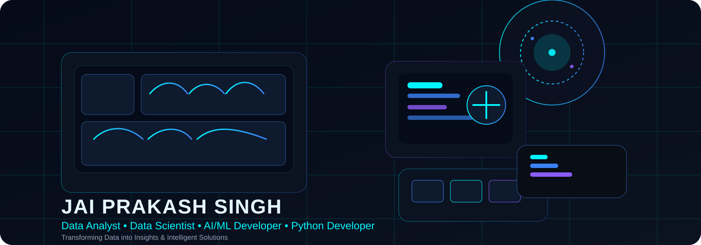
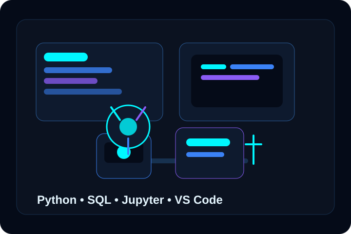
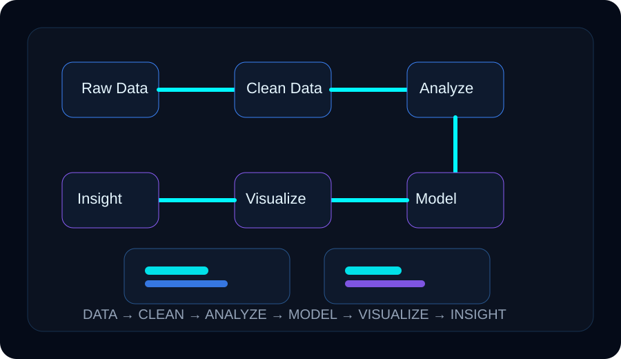
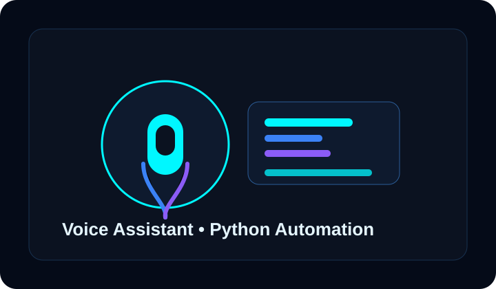
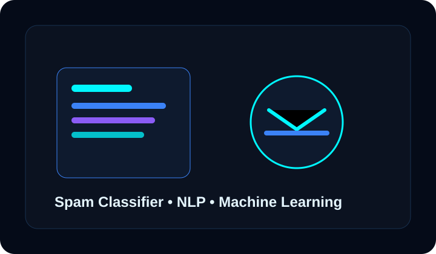
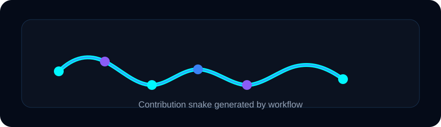

<p align="center">
  
</p>

<p align="center">
  
</p>

<p align="center">
  <a href="https://github.com/Jai3502"></a>
  <a href="https://linkedin.com/in/jai-prakash-066a8a3a3"></a>
  <a href="mailto:jaiprakash3502@gmail.com"></a>
</p>

<p align="center">
  
</p>

## 👋 About Me

My name is Jai Prakash Singh, and I am developing my path as a Data Analyst, Data Scientist, and AI/ML-focused Python Developer. I have built a strong interest in data analytics, data science, and intelligent solutions, and I am continuously strengthening my skills through practical projects and real-world data work.

I have completed my degree and have worked on projects such as a Voice Assistant and a Spam Email Classifier. These experiences helped me build a solid foundation in data handling, Python, automation, machine learning, and problem-solving. I enjoy working with datasets, uncovering meaningful patterns, and transforming raw information into insights that can support decision-making.

I am particularly interested in opportunities where I can use data to solve business problems, discover insights, and contribute to intelligent, data-driven solutions. I am a quick learner, adaptable, and committed to improving my technical and analytical skills every day.

<p align="center">
  
</p>

## 🔧 What I Do

| Area | Focus |
|---|---|
| Data Analytics | SQL, Excel, Power BI, Data Cleaning, Dashboard Development, Business Insights |
| Data Science | Python, Pandas, NumPy, Statistics, EDA, Data Visualization |
| Machine Learning | Scikit-learn, TensorFlow, PyTorch, Classification, Model Evaluation, Prediction |
| Automation & AI | Python Automation, Voice Assistant, AI Applications, Email Classification, Problem Solving |

## 🧠 Tech Stack

### Programming
 

### Data Analytics
  

### Data Science
   

### Machine Learning
   

### Tools
   

<p align="center">
  
</p>

## 📊 Data Analytics

- Data Cleaning
- Exploratory Data Analysis
- SQL and MySQL
- Power BI and Excel
- Dashboard Development
- Data Visualization
- Business Insights
- Reporting

## 🤖 AI & Machine Learning

- Machine Learning Fundamentals
- Classification
- Data Preprocessing
- Feature Engineering
- Model Evaluation
- Scikit-learn
- TensorFlow
- PyTorch
- NLP
- Spam Classification
- Python Automation

## 🚀 Featured Projects

### Voice Assistant
<p align="center">
  
</p>

A Python-based voice assistant project that focuses on automation, voice interaction, and practical Python programming.

- Technologies: Python, Speech Recognition, Automation
- Repository: [PROJECT_REPOSITORY_URL](PROJECT_REPOSITORY_URL)
- Live Demo: [PROJECT_DEMO_URL](PROJECT_DEMO_URL)
- Documentation: [PROJECT_DOCUMENTATION_URL](PROJECT_DOCUMENTATION_URL)

### Spam Email Classifier
<p align="center">
  
</p>

A machine learning project designed to classify emails or messages as spam or legitimate using text processing and classification techniques.

- Technologies: Python, Machine Learning, NLP, Scikit-learn, Pandas
- Repository: [PROJECT_REPOSITORY_URL](PROJECT_REPOSITORY_URL)
- Live Demo: [PROJECT_DEMO_URL](PROJECT_DEMO_URL)
- Documentation: [PROJECT_DOCUMENTATION_URL](PROJECT_DOCUMENTATION_URL)

## 🔄 Data Workflow

Raw Data
↓
Data Cleaning
↓
EDA
↓
Analysis
↓
Machine Learning
↓
Visualization
↓
Business Insights

## 📈 GitHub Analytics

<p align="center">
  
  
</p>

<p align="center">
  
</p>

<p align="center">
  
</p>

<p align="center">
  
</p>

<p align="center">
  
</p>

## 🐍 Contribution Snake

<p align="center">
  
</p>

## 🌱 Currently Improving

- Data Analysis
- Real-world Dataset Analysis
- Power BI Dashboards
- SQL
- Machine Learning
- Data Visualization
- Python

## 🎯 Career Focus

I am interested in opportunities involving data analytics, data science, business intelligence, machine learning, Python, and data-driven decision-making.

## 🤝 Connect With Me

<p align="center">
  <a href="https://github.com/Jai3502"></a>
  <a href="https://linkedin.com/in/jai-prakash-066a8a3a3"></a>
  <a href="mailto:jaiprakash3502@gmail.com"></a>
</p>

```python
while True:
    learn()
    analyze()
    build()
    improve()
```

<p align="center">
  
</p>
